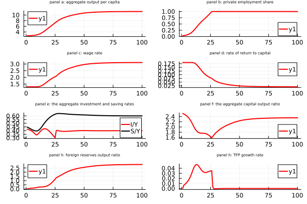
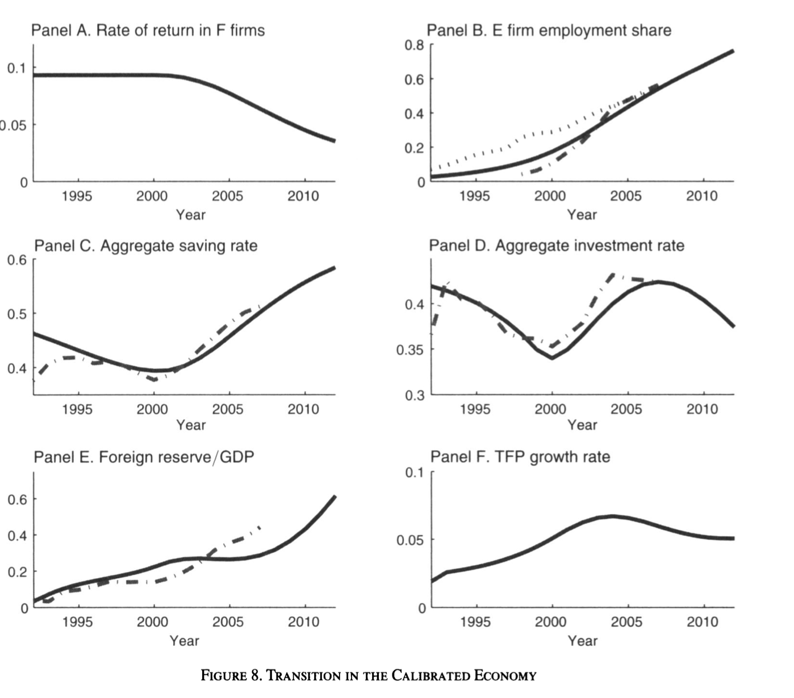
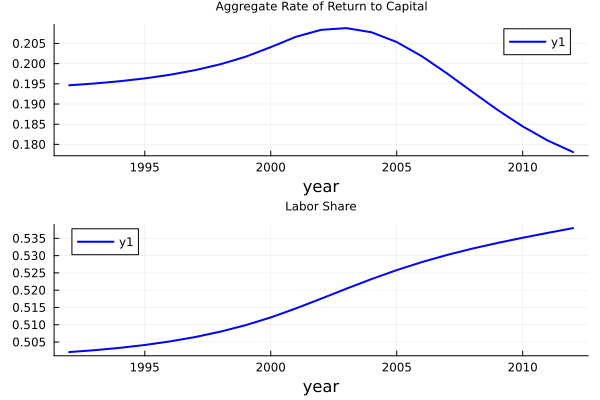

# Code and Results

We will introduce our replication code and results here.

# Installation

We need these packages：

```julia
import Pkg
Pkg.add("Plots")
Pkg.add("MAT")
Pkg.add("JLD2")
Pkg.add("Statistics")
Pkg.add("CSV")
Pkg.add("DataFrames")
```


# Parameters We set

Here we introduce all parameters we set and their main explanation, where we have our codes. 


### Parameter without calibration
```julia
bet=0.998; # discount factor of workers
bet_E=bet; # discount factor of entrepreneurs
r=0.0175; # world interest rate
sig=0.5; # the inverse of intertemporal substitution
alp=0.5; # capital output elasticity
del=0.10; # depreciation rate
g_n=0.03; # exogenous population growth
r_soe_ini=0.093; # initial lending rate for SOEs
ice=1-r/(r_soe_ini); # iceberg cost
```

### TFP growth
```julia
g_t=0.038; # exogenous TFP growth
bet=bet*(1+g_t)^(1-sig); # TFP growth adjusted discount factor
bet_E=bet_E*(1+g_t)^(1-sig); # TFP growth adjusted discount factor
```


### calibration targets
```julia
KY_F_E=2.65; # the ratio of K/Y in the F sector to K/Y in the E sector
rho_r=(r_soe_ini+0.09)/(r/(1-ice)); # the ratio of the rate of return in the E sector to that in the F sector
psi1=(rho_r*r/(1-ice)+del)/(r/(1-ice)+del)/KY_F_E # share of managerial compensation
ksi=(KY_F_E)*(alp/(1-alp))/(1-psi) # productivity ratio of E over F
```

### bank loan in the E sector
```julia
loan_asset=1; # loan asset ratio
eta=loan_asset*(1+r/(1-ice))/(1+rho_r*r/(1-ice)+(rho_r*r/(1-ice)-r/(1-ice))*loan_asset) # measure of financial frictions
```


### initial asset
```julia
initial_ratio=0.80;
initial_ratio_E=0.33;
```

### demographic structure
```julia
age_max=50; # maximum age
age_T=26; # the age when enterpreneurs become firm owners
age_T_w=31; # the age when workers retire
time_max=400; # the end of the economy
n_pre=100; # the initial size of workers
e_pre=5; # the initial size of enterpreneurs
```

### computing demographic structure
```julia
n_weight = zeros(Float64, age_max)
e_weight = zeros(Float64, age_max)
```

# How we will use those data?

# Functions we use


```@example
function fun_saving_pre_transition(x::Vector, dict::Dict)
    age_max = dict[:age_max]
    age_T_w = dict[:age_T_w]
    g_t = dict[:g_t]
    r = dict[:r]
    bet = dict[:bet]
    sig = dict[:sig]

    # Other definitions
    age = Int(x[1])  # current age
    wage = x[2]  # current wage
    wealth = x[3]  # current wealth

    # Generating interest rate adjusted life-cycle earnings and others
    w = zeros(Float64, age_max)
    for i in age:age_max
        if i < age_T_w
            w[i] = wage * ((1 + g_t) / (1 + r))^(i - age)  # earnings
        else
            w[i] = 0
        end
    end

    # Computing life-time wealth
    A = sum(w) + wealth * (1 + r)

    # Computing current optimal consumption and savings
    ratio = zeros(Float64, age_max)
    for i in age:age_max
        # the interest rate adjusted ratio of optimal consumption to consumption of the current age
        if i == age
            ratio[i] = 1
        else
            ratio[i] = (bet * (1 + r) / (1 + g_t))^(1 / sig) * (1 + g_t) / (1 + r) * ratio[i - 1]
        end
    end

    # Optimal consumption and savings
    consumption = A / sum(ratio)
    savings = wealth * r + wage - consumption
    sr = savings / (wealth * r + wage)  # saving rate

    # Computing next-period wealth
    wealth_prime = (wealth * (1 + r) + wage - consumption) / (1 + g_t)

    # Definition of y
    y = [savings, wealth_prime, sr, consumption]
    return y
end
```

```@example
function fun_saving_pre_transition_E(x::Vector, dict::Dict)
    age_max = dict[:age_max]
    age_T_w = dict[:age_T_w]
    g_t = dict[:g_t]
    r = dict[:r]
    bet_E = dict[:bet]
    sig = dict[:sig]

    # Other definitions
    age = Int(x[1])  # current age
    wage = x[2]  # current wage
    wealth = x[3]  # current wealth

    # Generating interest rate adjusted life-cycle earnings and others
    w = zeros(Float64, age_max)
    for i in age:age_max
        if i < age_T_w
            w[i] = wage * ((1 + g_t) / (1 + r))^(i - age)  # earnings
        else
            w[i] = 0
        end
    end

    # Computing life-time wealth
    A = sum(w) + wealth * (1 + r)

    # Computing current optimal consumption and savings
    ratio = zeros(Float64, age_max)
    for i in age:age_max
        # the interest rate adjusted ratio of optimal consumption to consumption of the current age
        if i == age
            ratio[i] = 1
        else
            ratio[i] = (bet_E * (1 + r) / (1 + g_t))^(1 / sig) * (1 + g_t) / (1 + r) * ratio[i - 1]
        end
    end

    # Optimal consumption and savings
    consumption = A / sum(ratio)
    savings = wealth * r + wage - consumption
    sr = savings / (wealth * r + wage)  # saving rate

    # Computing next-period wealth
    wealth_prime = (wealth * (1 + r) + wage - consumption) / (1 + g_t)

    # Definition of y
    y = [savings, wealth_prime, sr, consumption]
    return y
end
```

```@example
function fun_saving_E_existing(x::Vector, dictmain::Dict, dictopt::Dict)
   
    r = dictmain[:r]
    ice_t = dictmain[:ice_t]
    eta = dictmain[:eta]
    age_max = dictmain[:age_max]
    age_T = dictmain[:age_T]
    g_t = dictmain[:g_t]
    bet_E = dictmain[:bet_E]
    sig = dictmain[:sig]

    m_t = dictopt[:m_t]
    rho_t = dictopt[:rho_t]

    # Adjusting rate of return due to the endogenous borrowing constraint
    rho_t_ad = max.(rho_t, (rho_t.*(1 .+r./(1 .-ice_t)) .+ eta.*(rho_t .- r./(1 .-ice_t))) ./ (1 .+r./(1 .-ice_t) - eta.*(rho_t .- r./(1 .-ice_t))))

    # Other definitions
    age = Int(x[1])  # age
    wealth = zeros(Float64, age_max+1)
    wealth[age] = x[2]  # wealth

    # Generating interest rate adjusted life-cycle earnings and others
    w = zeros(Float64, age_max)
    for i in age:age_max
        if i < age_T
            w[i] = m_t[i-age+1] * ((1+g_t) / (1+r))^(i-age)  # earnings
        else
            w[i] = 0
        end
    end

    # Computing life-time wealth
    if age < age_T
        A = sum(w) + (1+r) * wealth[age]
    else
        A = sum(w) + (1+rho_t_ad[1]) * wealth[age]
    end

    # Computing current optimal consumption and savings
    ratio = zeros(Float64, age_max)
    for i in age:age_max
        if i == age
            ratio[i] = 1
        elseif i < age_T
            ratio[i] = (bet_E * (1+r) / (1+g_t))^(1/sig) * (1+g_t) / (1+r) * ratio[i-1]
        else
            ratio[i] = (bet_E * (1+rho_t_ad[i-age+1]) / (1+g_t))^(1/sig) * (1+g_t) / (1+rho_t_ad[i-age+1]) * ratio[i-1]
        end
    end 

    consumption = zeros(Float64, age_max)
    for i in age:age_max 
        if i == age
            consumption[i] = A / sum(ratio)
            if i < age_T
                wealth[i+1] = (wealth[i] * (1+r) + m_t[i-age+1] - consumption[i]) / (1+g_t)
            else
                wealth[i+1] = (wealth[i] * (1+rho_t_ad[i-age+1]) - consumption[i]) / (1+g_t)
            end
        elseif i < age_T
            consumption[i] = (bet_E * (1+r) / (1+g_t))^(1/sig) * consumption[i-1]
            wealth[i+1] = (wealth[i] * (1+r) + m_t[i-age+1] - consumption[i]) / (1+g_t)
        else
            consumption[i] = (bet_E * (1+rho_t_ad[i-age+1]) / (1+g_t))^(1/sig) * consumption[i-1]
            wealth[i+1] = (wealth[i] * (1+rho_t_ad[i-age+1]) - consumption[i]) / (1+g_t)
        end
    end

    # Definition of y
    result  = Dict(:wealth => wealth, :consumption => consumption)
    return result 
end
```

```@example
function fun_saving_E_newly_born(x::Vector, dictmain::Dict, dictopt::Dict)
    m_t = dictopt[:m_t]
    rho_t = dictopt[:rho_t]

    sig = dictmain[:sig]
    r = dictmain[:r]
    ice_t = dictmain[:ice_t]
    eta = dictmain[:eta]
    age_max = dictmain[:age_max]
    age_T = dictmain[:age_T]
    g_t = dictmain[:g_t]
    bet_E = dictmain[:bet_E]

    # Savings of entrepreneurs

    # Adjusting rate of return due to the endogenous borrowing constraint
    rho_t_ad = max.(rho_t, (rho_t.*(1 .+r./(1 .-ice_t)) .+ eta.*(rho_t .- r./(1 .-ice_t))) ./ (1 .+r./(1 .-ice_t) - eta.*(rho_t .- r./(1 .-ice_t))))

    # Other definitions
    tt = x[1]  # Year of birth

    # Agents born without assets
    wealth = zeros(Float64, age_max+1)

    # Generating interest rate adjusted life-cycle earnings and others
    w = zeros(Float64, age_max)
    for i = 1:age_max
        if i < age_T
            w[i] = m_t[tt+i-1] * ((1 + g_t) / (1 + r))^(i-1)  # Earnings
        else
            w[i] = 0
        end
    end

    # Computing lifetime wealth
    A = sum(w)

    # Computing current optimal consumption and savings
    ratio = zeros(Float64, age_max)
    for i = 1:age_max
        # The interest rate adjusted ratio of optimal consumption to consumption of the current age
        if i == 1
            ratio[i] = 1
        elseif i < age_T  # Being manager
            ratio[i] = (bet_E * (1 + r) / (1 + g_t))^(1 / sig) * (1 + g_t) / (1 + r) * ratio[i-1]
        else  # Become firm owner
            ratio[i] = (bet_E * (1 + rho_t_ad[tt+i-1]) / (1 + g_t))^(1 / sig) * (1 + g_t) / (1 + rho_t_ad[tt+i-1]) * ratio[i-1]
        end
    end

    # Optimal consumption and savings
    consumption = zeros(Float64, age_max)
    for i = 1:age_max
        if i == 1
            consumption[i] = A / sum(ratio)
            wealth[2] = (m_t[tt] - consumption[i]) / (1 + g_t)
        elseif i < age_T  # Being manager
            consumption[i] = (bet_E * (1 + r) / (1 + g_t))^(1 / sig) * consumption[i-1]
            wealth[i+1] = (wealth[i] * (1 + r) + m_t[tt+i-1] - consumption[i]) / (1 + g_t)
        else  # Become firm owner
            consumption[i] = (bet_E * (1 + rho_t_ad[tt+i-1]) / (1 + g_t))^(1 / sig) * consumption[i-1]
            wealth[i+1] = (wealth[i] * (1 + rho_t_ad[tt+i-1]) - consumption[i]) / (1 + g_t)
        end
    end

    # Definition of y
    result = Dict(:wealth => wealth, :consumption => consumption)

    return result 
end 
```

```@example
function fun_saving_F_existing(x::Vector, dictmain::Dict, dictopt::Dict)
    age_max = dictmain[:age_max]
    age_T_w = dictmain[:age_T_w]
    g_t = dictmain[:g_t]
    r = dictmain[:r]
    bet = dictmain[:bet]
    sig = dictmain[:sig]

    w_t = dictopt[:w_t]

    # Savings of entrepreneurs
    
    # Other definition
    age = Int(x[1])   # age
    wealth = zeros(Float64, age_max+1)  # wealth array
    wealth[age] = x[2]   # wealth at given age
    
    # Generating interest rate adjusted life-cycle earnings and others
    w = zeros(Float64, age_max)
    for i in age:age_max
        if i < age_T_w
            w[i] = w_t[i - age + 1] * ((1 + g_t) / (1 + r))^(i - age)  # Earnings
        else
            w[i] = 0
        end
    end
    
    # Computing lifetime wealth
    A = sum(w) + (1 + r) * wealth[age]
    
    # Computing current optimal consumption and savings
    ratio = zeros(Float64, age_max)
    for i in age:age_max
        if i == age
            ratio[i] = 1
        else
            ratio[i] = (bet * (1 + r) / (1 + g_t))^(1 / sig) * (1 + g_t) / (1 + r) * ratio[i - 1]
        end
    end
    
    # Optimal consumption and savings
    consumption = zeros(Float64, age_max)
    for i in age:age_max
        if i == age
            consumption[i] = A / sum(ratio)
            if i < age_T_w
                wealth[i + 1] = (wealth[i] * (1 + r) + w_t[i - age + 1] - consumption[i]) / (1 + g_t)
            else
                wealth[i + 1] = (wealth[i] * (1 + r) - consumption[i]) / (1 + g_t)
            end
        elseif i < age_T_w  # Being workers
            consumption[i] = (bet * (1 + r) / (1 + g_t))^(1 / sig) * consumption[i - 1]
            wealth[i + 1] = (wealth[i] * (1 + r) + w_t[i - age + 1] - consumption[i]) / (1 + g_t)
        else  # Become retirees
            consumption[i] = (bet * (1 + r) / (1 + g_t))^(1 / sig) * consumption[i - 1]
            wealth[i + 1] = (wealth[i] * (1 + r) - consumption[i]) / (1 + g_t)
        end
    end
    
    # Definition of y
    result  = Dict(:wealth => wealth, :consumption => consumption)
    return result 
end
```

```@example
function fun_saving_F_newly_born(x::Vector, dictmain::Dict, dictopt::Dict)
    age_max = dictmain[:age_max]
    age_T_w = dictmain[:age_T_w]
    g_t = dictmain[:g_t]
    r = dictmain[:r]
    bet = dictmain[:bet]
    sig = dictmain[:sig]

    w_t = dictopt[:w_t]

    # Savings of entrepreneurs
    
    # Other definition
    tt = x[1]  # year of birth
    
    # Agents born without assets
    wealth = zeros(Float64, age_max+1)
    wealth[1] = 0
    
    # Generating interest rate adjusted life-cycle earnings and others
    w = zeros(Float64, age_max)
    for i in 1:age_max
        if i < age_T_w
            w[i] = w_t[tt+i-1] * ((1 + g_t) / (1 + r))^(i-1)  # Earnings
        else
            w[i] = 0
        end
    end
    
    # Computing lifetime wealth
    A = sum(w)
    
    # Computing current optimal consumption and savings
    ratio = zeros(Float64, age_max)
    for i in 1:age_max
        # The interest rate adjusted ratio of optimal consumption to consumption of the current age
        if i == 1
            ratio[i] = 1
        else
            ratio[i] = (bet * (1 + r) / (1 + g_t))^(1 / sig) * (1 + g_t) / (1 + r) * ratio[i - 1]
        end
    end
    
    # Optimal consumption and savings
    consumption = zeros(Float64, age_max)
    for i in 1:age_max
        if i == 1
            consumption[i] = A / sum(ratio)
            wealth[2] = (w_t[tt] - consumption[i]) / (1 + g_t)
        elseif i < age_T_w  # Being workers
            consumption[i] = (bet * (1 + r) / (1 + g_t))^(1 / sig) * consumption[i - 1]
            wealth[i + 1] = (wealth[i] * (1 + r) + w_t[tt+i-1] - consumption[i]) / (1 + g_t)
        else  # Become retirees
            consumption[i] = (bet * (1 + r) / (1 + g_t))^(1 / sig) * consumption[i - 1]
            wealth[i + 1] = (wealth[i] * (1 + r) - consumption[i]) / (1 + g_t)
        end
    end
    
    # Definition of y
    result = Dict(:wealth => wealth, :consumption => consumption)

    return result 
end
```


# After we set those functions, what shall we do for data?

### Do the pre transition

```julia
k_pre = (alp / (r / (1 - ice) + del))^(1 / (1 - alp)) * nw_pre  # total capital during pre-transition period (all in the F sector)
w_pre = (1 - alp) * (alp / (r / (1 - ice) + del))^(alp / (1 - alp))  # wage rate during pre-transition period

# for workers
wealth_pre = zeros(Float64, age_max)
sr_pre = zeros(Float64, age_max)
consumption_pre = zeros(Float64, age_max)

for i in 1:age_max
    x = zeros(Float64, 3) # [age, wage, wealth]
    x[1] = i 
    if i < age_T_w
        x[2] = w_pre  # wage
    else
        x[2] = 0  # wage after retirement
    end
    if i == 1  # born without assets
        wealth_pre[i] = 0  # wealth
    end
    x[3] = wealth_pre[i]  # wealth
    y = fun_saving_pre_transition(x, dictmain)
    sr_pre[i] = y[3, 1]  # saving rate
    consumption_pre[i] = y[4, 1]  # consumption
    if i < age_max
        wealth_pre[i + 1] = y[2, 1]
    end
end

# initial condition
wealth_pre .= initial_ratio * wealth_pre

# save data
save("data_pre.jld2", "wealth_pre", wealth_pre)

# for entrepreneurs
wealth_pre_E = zeros(Float64, age_max)
sr_pre_E = zeros(Float64, age_max)
consumption_pre_E = zeros(Float64, age_max)

for i in 1:age_max
    x = zeros(Float64, 3) # [age, wage, wealth]
    x[1] = i 
    if i < age_T_w
        x[2] = w_pre  # wage
    else
        x[2] = 0  # wage after retirement
    end
    if i == 1  # born without assets
        wealth_pre_E[i] = 0  # wealth
    end
    x[3] = wealth_pre_E[i]  # wealth
    y = fun_saving_pre_transition_E(x, dictmain)
    sr_pre_E[i] = y[3, 1]  # saving rate
    consumption_pre_E[i] = y[4, 1]  # consumption
    if i < age_max
        wealth_pre_E[i + 1] = y[2, 1]
    end
end

# initial condition
wealth_pre_E .= initial_ratio_E * wealth_pre_E


# save data
save("data_pre_E.jld2", "wealth_pre_E", wealth_pre_E)
```


### Do Transition
```julia
# iteration choices
relax = 0.75
iter_max = 100
tol = 1e-4
dev_max = 1
iter = 1

# initial guess
# initial_guess

# true results
data_result = matread("/Users/xuyuxuan/Desktop/computer econ/project/112395-V1/matlab/data_result.mat")

m_t = transpose(data_result["m_t"])
w_t = transpose(data_result["w_t"])
rho_t = transpose(data_result["rho_t"])
dictopt = Dict(:m_t => m_t, :w_t => w_t, :rho_t => rho_t)

wealth_E = zeros(Float64, (time_max+age_max-1), (age_max))
consumption_E = zeros(Float64, (time_max+age_max-1), (age_max))

E_t = zeros(Float64, time_max)
ae = zeros(Float64, time_max, age_max)
AE = zeros(Float64, time_max, age_max)
loan_ratio = zeros(Float64, time_max)
loan = zeros(Float64, time_max, age_max)
ke = zeros(Float64, time_max, age_max)
ne = zeros(Float64, time_max, age_max)
KE = zeros(Float64, time_max, age_max)
NE = zeros(Float64, time_max, age_max)
LE = zeros(Float64, time_max, age_max)
AE_t = zeros(Float64, time_max)
NE_t = zeros(Float64, time_max)
KE_t = zeros(Float64, time_max)
LE_t = zeros(Float64, time_max)
N_t = zeros(Float64, time_max)
w_t_new = zeros(Float64, (time_max+age_max-1))
rho_t_new = zeros(Float64, (time_max+age_max-1))
m_t_new = zeros(Float64, (time_max+age_max-1))
YE_t = zeros(Float64, time_max)
M_t = zeros(Float64, time_max)

dev_w = zeros(Float64, (time_max+age_max-1))
dev_rho = zeros(Float64, (time_max+age_max-1))
dev_m = zeros(Float64, (time_max+age_max-1))


# start to iterate
while dev_max > tol && iter < iter_max

    # an indicator for the end of transition
    I_end = 0
    
    # existing entrepreneurs
    for ii in 2:age_max
        # computing existing entrepreneurs wealth given the guess of m_t and rho_t
        result = fun_saving_E_existing([ii, wealth_pre_E[ii]], dictmain, dictopt)
        wealth = result[:wealth]
        consumption = result[:consumption]
        # wealth time series for the existing entrepreneur with age ii
        for tt in 1:(age_max - ii + 1)
            wealth_E[tt, ii + tt - 1] = wealth[ii + tt - 1]
            consumption_E[tt, ii + tt - 1] = consumption[ii + tt - 1]
        end
    end
   
    # newly born entrepreneurs
    for tt in 1:time_max
        # computing entrepreneurs wealth given the guess of m_t and rho_t
        result = fun_saving_E_newly_born([tt], dictmain, dictopt)
        wealth = result[:wealth]
        consumption = result[:consumption]
        # wealth time series for the existing entrepreneur with age ii
        for ii in 1:age_max
            wealth_E[tt + ii - 1, ii] = wealth[ii]
            consumption_E[tt + ii - 1, ii] = consumption[ii]
        end
    end


    # update new factor prices time series
    for t in 1:time_max
        # fixed size of managers
        E_t[t] = e_pre - ee_pre

        # assets in the E sector
        for i in 1:age_max
            ae[t, i] = wealth_E[t, i]  # entrepreneurial capital owned by an entrepreneur at time t with age i
            AE[t, i] = e_weight[i] * ae[t, i]  # total capital owned by all entrepreneurs at time with age i
        end
        
        # capital and labor in the E sector
        for i in age_T:age_max
            if rho_t[t] >= r / (1 - ice_t[t])  # borrowing is profitable
                loan_ratio[t] = eta * (1 + rho_t[t]) / (1 + r / (1 - ice_t[t]) - eta * (rho_t[t] - r / (1 - ice_t[t])))  # loan asset ratio
                loan[t, i] = wealth_E[t, i] * loan_ratio[t]
                ke[t, i] = wealth_E[t, i] + loan[t, i]  # entrepreneurial capital owned by an entrepreneur at time t with age i
            else  # borrowing is not profitable
                loan[t, i] = 0
                ke[t, i] = wealth_E[t, i]  # entrepreneurial capital owned by an entrepreneur at time t with age i
            end
           
            ne[t, i] = ke[t, i] * ((1 - alp) * (1 - psi) * ksi^(1 - alp) / w_t[t])^(1 / alp)  # labor employed by an entrepreneur at time with age i
            KE[t, i] = e_weight[i] * ke[t, i]  # total capital owned by all entrepreneurs at time with age i
            NE[t, i] = e_weight[i] * ne[t, i]  # total labor employed by all entrepreneurs at time with age i
            LE[t, i] = e_weight[i] * loan[t, i]  # total loan
        end

        # resource allocation
        AE_t[t] = sum(AE[t, :])  # aggregate capital in the E sector
        NE_t[t] = sum(NE[t, :])  # aggregate employment in the E sector
        KE_t[t] = sum(KE[t, :])  # when rho > r
        LE_t[t] = sum(LE[t, :])  # total loan
        N_t[t] = nw_pre  # the size of workers (no migration)

        # factor prices
        if NE_t[t] >= N_t[t] && I_end == 0
            I_end = 1
            I_t = t
        elseif I_end == 1
            I_end = 1
        end

        if I_end == 0
            w_t_new[t] = (1 - alp) * (alp / (r / (1 - ice_t[t]) + del))^(alp / (1 - alp))  # wage rate
        else
            NE_t[t] = N_t[t]
            w_t_new[t] = (1 - psi) * (1 - alp) * (KE_t[t] / N_t[t])^alp * ksi^(1 - alp)  # wage rate
        end
        rho_t_new[t] = max(r, (1 - psi)^(1 / alp) * ksi^((1 - alp) / alp) * ((1 - alp) / w_t_new[t])^((1 - alp) / alp) * alp - del)  # the internal rate of returns for entrepreneurs
        YE_t[t] = KE_t[t]^alp * (ksi * NE_t[t])^(1 - alp)  # aggregate output in the E sector
        M_t[t] = psi * YE_t[t]  # total managerial compensations
        m_t_new[t] = M_t[t] / E_t[t]  # compensations for young entrepreneurs
    end

    # imposing monotonicity
    # if I_end == 1
    #     NE_t[I_t:time_max] = N_t[t]
    #     w_t_new[I_t:time_max] = (1 - psi) * (1 - alp) * (KE_t[I_t:time_max] ./ N_t[I_t:time_max]).^alp * ksi^(1 - alp)  # wage rate
    #     KF_t[I_t:time_max] = 0
    # end

    # steady state assumption
    w_t_new[time_max + 1:time_max + age_max - 1] .= w_t_new[time_max]
    rho_t_new[time_max + 1:time_max + age_max - 1] .= rho_t_new[time_max]
    m_t_new[time_max + 1:time_max + age_max - 1] .= m_t_new[time_max]

    # deviation
    global dev_w = abs.(w_t_new .- w_t)
    global dev_rho = abs.(rho_t_new .- rho_t)
    global dev_m = abs.(m_t_new .- m_t)
    dev_w_max = maximum(dev_w)
    dev_rho_max = maximum(dev_rho)
    dev_m_max = maximum(dev_m)
    global dev_max = maximum([dev_w_max, dev_rho_max, dev_m_max])

    # renew
    w_t .= w_t .* relax .+ w_t_new .* (1 - relax)
    rho_t .= rho_t .* relax .+ rho_t_new .* (1 - relax)
    m_t .= m_t .* relax .+ m_t_new .* (1 - relax)
    global iter += 1
end

# result
save("data_result.jld2", Dict("m_t" => m_t, "w_t" => w_t, "rho_t" => rho_t))
```

### Have result (for six panel and figures)
```julia
# workers savings and assets
AF = zeros(Float64, time_max, age_max)
CF = zeros(Float64, time_max, age_max)
CE = zeros(Float64, time_max, age_max)

N_t = zeros(Float64, time_max)
AF_t = zeros(Float64, time_max)
CF_t = zeros(Float64, time_max)
CE_t = zeros(Float64, time_max)
KF_t = zeros(Float64, time_max)
YF_t = zeros(Float64, time_max)
NF_t = zeros(Float64, time_max)
NE_N_t = zeros(Float64, time_max)
IF_t = zeros(Float64, time_max)
IE_t = zeros(Float64, time_max)
IF_Y_t = zeros(Float64, time_max)
I_Y_t = zeros(Float64, time_max)
Y_N_t = zeros(Float64, time_max)
SE_YE_t = zeros(Float64, time_max)
SE_t = zeros(Float64, time_max)
SF_YF_t = zeros(Float64, time_max)
IE_Y_t = zeros(Float64, time_max)
SF_t = zeros(Float64, time_max)
FA_Y_t = zeros(Float64, time_max)
BoP_Y_t = zeros(Float64, time_max)
TFP_t = zeros(Float64, time_max)
YG_t = zeros(Float64, time_max)
K_Y_t = zeros(Float64, time_max)
S_Y_t = zeros(Float64, time_max)
NG_t = zeros(Float64, time_max)
xxx_t = zeros(Float64, time_max)
xx1_t = zeros(Float64, time_max)
xx2_t = zeros(Float64, time_max)
xx3_t = zeros(Float64, time_max)
RR_t = zeros(Float64, time_max)
labor_share_t = zeros(Float64, time_max)

wealth_F = zeros(Float64, (time_max+age_max-1), (age_max))
consumption_F = zeros(Float64, (time_max+age_max-1), (age_max))

#=consumption_E = dicttrans[:consumption_E]
NE_t = dicttrans[:NE_t]
YE_t = dicttrans[:YE_t]
KE_t = dictrans[:KE_t]
AE_t = dicttrans[:AE_t]
LE_t = dictrans[:LE_t]=#

for ii = 2:age_max

    # computing existing workers wealth given the guess of  m_t and rho_t
    result=fun_saving_F_existing([ii,wealth_pre[ii]], dictmain, dictopt)
    wealth = result[:wealth]
    consumption = result[:consumption]
            
    # wealth time series for the existing workers with age ii
    for tt = 1:age_max-ii+1
        wealth_F[tt,ii+tt-1]= wealth[ii+tt-1]
        consumption_F[tt,ii+tt-1]= consumption[ii+tt-1]
    end
end # existing workers

# newly born workers
for tt = 1:time_max
        
    # computing workers wealth given the guess of  m_t and rho_t
    result=fun_saving_F_newly_born([tt], dictmain, dictopt)
    wealth = result[:wealth]
    consumption = result[:consumption]

    # wealth time series for the existing enterpreneurs with age ii
    for ii = 1:age_max
        wealth_F[tt+ii-1,ii]= wealth[ii]
        consumption_F[tt+ii-1,ii]= consumption[ii]
    end
end # newly born workers

# demographic structure and others
for t = 1:time_max
    
    # no migration
    N_t[t]=nw_pre
    
    # total assets of workers and total consumptions
    for i = 1:age_max
        AF[t,i]=n_weight[i]*wealth_F[t,i] 
        CF[t,i]=n_weight[i]*consumption_F[t,i]
        CE[t,i]=e_weight[i]*consumption_E[t,i]
    end

    AF_t[t]=sum(AF[t,:]) # aggregate capital in the E sector
    CF_t[t]=sum(CF[t,:]) # aggregate consumption in the F sector
    CE_t[t]=sum(CE[t,:]) # aggregate consumption in the E sector
    
    # the F sector
    if NE_t[t] < N_t[t]
        KF_t[t]=(alp/(r/(1-ice_t[t])+del))^(1/(1-alp))*(N_t[t]-NE_t[t]) # aggregate capital in the F sector
        YF_t[t]=KF_t[t]^alp*(N_t[t]-NE_t[t])^(1-alp) # aggregate output in the F sector
        NF_t[t]=N_t[t]-NE_t[t] # aggregate workers in the F sector
    else
        KF_t[t]=0
        YF_t[t]=0
        NF_t[t]=0
    end
end

# aggregation
Y_t= YF_t+YE_t

K_t= KF_t+KE_t

C_t= CF_t+CE_t

for t = 1:time_max-1
    
    # private employment share
    NE_N_t[t]=NE_t[t]/N_t[t]
    
    # computing investment in the F sector
    IF_t[t]=(1+g_t)*(1+g_n)*KF_t[t+1]-(1-del)*KF_t[t]
    # -r*ice_t(t)/(1-ice_t(t))
    
    # computing investment in the E sector
    IE_t[t]=(1+g_t)*(1+g_n)*KE_t[t+1]-(1-del)*KE_t[t]
    
    # investment rates in the two sector
    if YF_t[t]>0
        IF_Y_t[t]=IF_t[t]/YF_t[t]
    else
        IF_Y_t[t]=0
    end
    IE_Y_t[t]=IE_t[t]/YE_t[t]
    
    # computing workers savings
    SF_t[t]=(1+g_t)*(1+g_n)*AF_t[t+1]-AF_t[t]+del*KF_t[t]
    if YF_t[t] > 0
        SF_YF_t[t]=SF_t[t]/YF_t[t]
    end

    # computing enterpreneurs savings
    SE_t[t]=(1+g_t)*(1+g_n)*AE_t[t+1]-AE_t[t]+del*KE_t[t]
    SE_YE_t[t]=SE_t[t]/YE_t[t]
    
    # aggregate output per capita
    Y_N_t[t]=Y_t[t]/N_t[t]
    
    # aggregate investment rate
    I_Y_t[t]=(IF_t[t]+IE_t[t])/Y_t[t]
    
    # aggregate saving rate
    S_Y_t[t]=(SF_t[t]+SE_t[t])/Y_t[t]

    # capital output ratio
    K_Y_t[t]=K_t[t]/Y_t[t]
    
    # capital outflows
    FA_Y_t[t]=(AE_t[t]+AF_t[t]-K_t[t])/Y_t[t] # stock
    BoP_Y_t[t]=S_Y_t[t]-I_Y_t[t] # flow
    
    if t > 1
        TFP_t[t]=Y_t[t]/Y_t[t-1]-alp*K_t[t]/K_t[t-1]-(1-alp)*N_t[t]/N_t[t-1]
        YG_t[t]=(Y_t[t]/Y_t[t-1]-1)+g_n+g_t
        NG_t[t]=(NE_N_t[t]/NE_N_t[t-1]-1)
    end
    
    # test
    xxx_t[t]=C_t[t]+SF_t[t]+SE_t[t]+r*ice_t[t]/(1-ice_t[t])*KF_t[t]+r*ice_t[t]/(1-ice_t[t])*LE_t[t]-Y_t[t]-r*FA_Y_t[t]*Y_t[t]
    xx1_t[t]=CF_t[t]+AF_t[t+1]*(1+g_t)*(1+g_n)-(w_t[t]*nw_pre+(1+r)*AF_t[t])
    xx2_t[t]=CE_t[t]+AE_t[t+1]*(1+g_t)*(1+g_n)-(m_t[t]*(e_pre-ee_pre)+(1+r)*AE_t[t]+(rho_t[t]-r)*(KE_t[t]-LE_t[t])+(rho_t[t]-r/(1-ice_t[t]))*LE_t[t])
    xx3_t[t]=YE_t[t]-del*KE_t[t]-(m_t[t]*(e_pre-ee_pre)+rho_t[t]*KE_t[t]+w_t[t]*NE_t[t])
    
    # aggregate rate of return to capital
    RR_t[t]=KE_t[t]/K_t[t]*rho_t[t]+KF_t[t]/K_t[t]*r/(1-ice_t[t])+del
    
    # labor share
    labor_share_t[t]=(w_t[t]*nw_pre+0.6*m_t[t]*(e_pre-ee_pre))/Y_t[t]

end

Y_data=Y_t[1:21]
K_data=K_t[1:21]

save("YK_data.jld2", "Y_data", Y_data, "K_data", K_data)

# TFP growth from 1998 through 2005
TFP_growth=Y_t[14]/Y_t[7]-alp*K_t[14]/K_t[7]-(1-alp)*N_t[14]/N_t[7]
output_growth=Y_t[14]/Y_t[7]-1
K_growth=K_t[14]/K_t[7]-1
w_growth=w_t[14]/w_t[7]-1
annual_TFP_growth=(1+TFP_growth)^(1/7)-1+(1-alp)*g_t
annual_output_growth=(1+output_growth)^(1/7)-1+g_n+g_t
annual_wage_growth=(1+w_growth)^(1/7)-1+g_t
annual_K_growth=(1+K_growth)^(1/7)-1+g_t+g_n

TFP_growth_93_04=Y_t[13]/Y_t[2]-alp*K_t[13]/K_t[2]-(1-alp)*N_t[13]/N_t[2]
annual_TFP_growth_93_04=(1+TFP_growth_93_04)^(1/11)-1+(1-alp)*g_t

# aggregate rate of return in 1998
rate_of_return_1998=KF_t[7]/K_t[7]*(r/(1-ice_t[7])+del)+KE_t[7]/K_t[7]*(rho_t[7]+del)

# average saving rate from 1998 to 2005
ave_S_Y=mean(S_Y_t[7:14])

#########
# Figures
#########

#Figure 1

time_begin=1
time_end=100
tt=[time_begin:time_end]

f1p1 = plot(tt, Y_N_t[time_begin:time_end], title="panel a: aggregate output per capita",titlefontsize=5, linewidth=2, color=:red)

# subplot(4,2,2)
# plot(tt,NE_t(time_begin:time_end),'r','linewidth',2)
# # gtext('employment in the E sector')
# hold on
# plot(tt,N_t(time_begin:time_end),'k','linewidth',2)
# # gtext('total employment')
# title('panel b: employment')
# 
# hold off

f1p2 = plot(tt, NE_N_t[time_begin:time_end], title="panel b: private employment share", titlefontsize=5, linewidth=2, color=:red)

f1p3 = plot(tt, w_t[time_begin:time_end], title="panel c: wage rate", titlefontsize=5,linewidth=2, color=:red)

# plot(tt,m_t(time_begin:time_end),'r','linewidth',2)
# # gtext('managerial compensations')
# hold on
# gtext('wage rate')
# title('panel c: income inequality')

f1p4 = plot(tt, rho_t[time_begin:time_end], title="panel d: rate of return to capital", titlefontsize=5, linewidth=2, color=:red)

# gtext('the rate of returns for entrepreneurs')
#r_t(time_begin:time_end)=r
#plot(tt,r_t(time_begin:time_end)./(1-ice_t(time_begin:time_end)),'k','linewidth',2)
# gtext('the international interest rate')

subplot = plot(tt, I_Y_t[time_begin:time_end], label="I/Y", color=:red, linewidth=2)
plot!(subplot, tt, S_Y_t[time_begin:time_end], label="S/Y", color=:black, linewidth=2)
f1p5 = plot!(subplot, title="panel e: the aggregate investment and saving rates",titlefontsize=5 )

f1p6 = plot(tt, K_Y_t[time_begin:time_end], title="panel f: the aggregate capital output ratio", titlefontsize=5, linewidth=2, color=:red)

f1p7 = plot(tt, FA_Y_t[time_begin:time_end], title="panel h: foreign reserves output ratio", titlefontsize=5, linewidth=2, color=:red)

f1p8 = plot(tt, TFP_t[time_begin:time_end], title="panel h: TFP growth rate", titlefontsize=5, linewidth=2, color=:red)

f1 = plot(f1p1, f1p2, f1p3, f1p4, f1p5, f1p6, f1p7, f1p8, layout=(4,2))

savefig(f1, "figure_1.png")

data_sav=[0.375905127,
0.407118937,
0.417687893,
0.418696583,
0.40780248,
0.410464312,
0.403822419,
0.38944417,
0.377046856,
0.386282215,
0.404312245,
0.432183421,
0.45699599,
0.48157501,
0.501039245,
0.51206739
]

data_inv=[0.365907013,
0.425514577,
0.405060796,
0.402900174,
0.38812706,
0.366991801,
0.361881671,
0.361607682,
0.352842054,
0.36494929,
0.378603128,
0.410289533,
0.431546215,
0.427396271,
0.425903209,
0.423250045
]

data_res=[0.038897003,
0.033068468,
0.088594251,
0.09722219,
0.117766451,
0.1420134,
0.138692692,
0.140515342,
0.138805234,
0.161149952,
0.196974228,
0.244702191,
0.314965846,
0.355479964,
0.383515959,
0.441448679
]

#Figure 2

# end of year
end_year=2012

subplot1 = plot([1992:end_year], S_Y_t[1:end_year-1992+1], label="model", color=:blue, linewidth=2)

plot!(subplot1, [1992:2007], data_sav, label="data", color=:red, linewidth=2)

f2p1 = plot(subplot1, title="Aggregate Saving Rate", titlefontsize=8, xlabel="year")


subplot2 = plot([1992:end_year], I_Y_t[1:end_year-1992+1], label="model", color=:blue, linewidth=2)

plot!(subplot2, [1992:2007], data_inv, label="data", color=:red, linewidth=2)

f2p2 = plot(subplot2, title="Aggregate Investment Rate", titlefontsize=8,xlabel="year")

f2 = plot(f2p1, f2p2, layout=(2,1))

savefig(f2, "figure_2.png")

data_em_sh=[0.041140261,
0.063212681,
0.10366673,
0.168350106,
0.232185343,         
0.322086332,
0.434391151,
0.474376982,
0.522120471,
0.563805401
]

data_em_sh_agg=1/100*[7.12,
9.21,
12.41,
15.58,
17.36,
19.24,
25.79,
28.14,
28.86,
31.51,
36.28,
40.63,
43.94,
47.7,
50.69,
53.84
];

data_SI_Y=[0.009998114,
-0.01839564,
0.012627097,
0.015796409,
0.01967542,
0.043472511,
0.041940748,
0.027836488,
0.024204802,
0.021332925,
0.025709117,
0.021893888,
0.025449774,
0.054178739,
0.075136036,
0.088817345
];

#Figure 3

subplot3 = plot([1992:end_year], NE_N_t[1:end_year-1992+1], label="model", color=:blue, linewidth=2)

plot!(subplot3, [1998:2007], data_em_sh, label="firm data", color=:red, linewidth=2)

plot!(subplot3, [1992:2007], data_em_sh_agg, label="aggregate data", color=:black, linewidth=2)

f3 = plot(subplot3, title="Private Employment Share", titlefontsize=8, xlabel="year")

savefig(f3, "figure_3.png")


#Figure 4

subplot4 = plot([1992:end_year], BoP_Y_t[1:end_year-1992+1], label="model", color=:blue, linewidth=2)

plot!(subplot4, [1992:2007], data_SI_Y, label="data", color=:red, linewidth=2)

f4p1 = plot(subplot4, title="Net Export GDP Ratio",titlefontsize=8, xlabel="year")


subplot5 = plot([1992:end_year], FA_Y_t[1:end_year-1992+1], label="model", color=:blue, linewidth=2)

plot!(subplot5, [1992:2007], data_res, label="data", color=:red, linewidth=2)

f4p2 = plot(subplot5, title="Foreign Reserve GDP Ratio", titlefontsize=8, xlabel="year")

f4 = plot(f4p1, f4p2, layout=(2,1))

savefig(f4, "figure_4.png")

#Figure 5 

subplot6 = plot([1993:end_year], TFP_t[2:end_year-1992+1], color=:blue, linewidth=2)
f5 = plot(subplot6, title="TFP Growth Rate", titlefontsize=8, xlabel="year")

savefig(f5, "figure_5.png")

# subplot(1,1,1)
# plot([1993:end_year],YG_t(2:end_year-1992+1),'-','color','b','linewidth',2)
# xlabel('year')
# title('GDP growth rate')
# print -f1 -r600 -depsc 'TFP'

#Figure 6

subplot7 = plot([1992:2012], ice_t[1:21], color=:blue, linewidth=2)
f6 = plot(subplot7, title="Iceburg Costs", titlefontsize=8, xlabel="year")

savefig(f6, "figure_6.png")


#Figure 7

subplot8 = plot([1992:2012], RR_t[1:21], color=:blue, linewidth=2) 
f7p1 = plot(subplot8, title="Aggregate Rate of Return to Capital", titlefontsize=8,xlabel="year")

subplot9 = plot([1992:2012], labor_share_t[1:21], color=:blue, linewidth=2)
f7p2 = plot(subplot9, title="Labor Share", titlefontsize=8, xlabel="year")

f7 = plot(f7p1, f7p2, layout=(2,1))

savefig(f7, "figure_7.png")

#Figure 8

f8p1 = scatter(NE_N_t[1:time_max-1], Y_t[1:time_max-1], xlabel="private employment share", ylabel="GDP")

f8p2 = scatter(NG_t, YG_t, xlabel="private employment share growth rate", ylabel="GDP growth rate")

f8 = plot(f8p1, f8p2, layout=(2,1))

savefig(f8, "figure_8.png")
```

```julia
# workers savings and assets
wealth_F = zeros(Float64, (time_max+age_max-1), (age_max))
consumption_F = zeros(Float64, (time_max+age_max-1), (age_max))

AF = zeros(Float64, time_max, age_max)
CF = zeros(Float64, time_max, age_max)
CE = zeros(Float64, time_max, age_max)

N_t = zeros(Float64, time_max)
AF_t = zeros(Float64, time_max)
CF_t = zeros(Float64, time_max)
CE_t = zeros(Float64, time_max)
KF_t = zeros(Float64, time_max)
YF_t = zeros(Float64, time_max)
NF_t = zeros(Float64, time_max)
NE_N_t = zeros(Float64, time_max)
IF_t = zeros(Float64, time_max)
IE_t = zeros(Float64, time_max)
IF_Y_t = zeros(Float64, time_max)
I_Y_t = zeros(Float64, time_max)
Y_N_t = zeros(Float64, time_max)
SE_YE_t = zeros(Float64, time_max)
SE_t = zeros(Float64, time_max)
SF_YF_t = zeros(Float64, time_max)
IE_Y_t = zeros(Float64, time_max)
SF_t = zeros(Float64, time_max)
FA_Y_t = zeros(Float64, time_max)
BoP_Y_t = zeros(Float64, time_max)
TFP_t = zeros(Float64, time_max)
YG_t = zeros(Float64, time_max)
K_Y_t = zeros(Float64, time_max)
S_Y_t = zeros(Float64, time_max)

for ii = 2:age_max
    
    # computing existing workers wealth given the guess of  m_t and rho_t
    result=fun_saving_F_existing([ii,wealth_pre[ii]], dictmain, dictopt)
    wealth = result[:wealth]
    consumption = result[:consumption]    

    # wealth time series for the existing workers with age ii
    for tt = 1:age_max-ii+1
        wealth_F[tt,ii+tt-1]=wealth[ii+tt-1]
        consumption_F[tt,ii+tt-1]=consumption[ii+tt-1]
    end    
end # existing workers

# newly born workers
for tt = 1:time_max
        
    # computing workers wealth given the guess of  m_t and rho_t
    result=fun_saving_F_newly_born([tt], dictmain, dictopt)
    wealth = result[:wealth]
    consumption = result[:consumption]

    # wealth time series for the existing enterpreneur with age ii
    for ii = 1:age_max
        wealth_F[tt+ii-1,ii]=wealth[ii]
        consumption_F[tt+ii-1,ii]=consumption[ii]
    end
end # newly born workers

# demographic structure and others
for t = 1:time_max
    
    # no migration
    N_t[t]=nw_pre
    
    # total assets of workers and total consumptions
    for i = 1:age_max
        AF[t,i]=n_weight[i]*wealth_F[t,i] 
        CF[t,i]=n_weight[i]*consumption_F[t,i]
        CE[t,i]=e_weight[i]*consumption_E[t,i]
    end
    AF_t[t]=sum(AF[t,:]) # aggregate capital in the E sector
    CF_t[t]=sum(CF[t,:]) # aggregate consumption in the F sector
    CE_t[t]=sum(CE[t,:]) # aggregate consumption in the E sector
    
    # the F sector
    if NE_t[t] < N_t[t]
        KF_t[t]=(alp/(r/(1-ice_t[t])+del))^(1/(1-alp))*(N_t[t]-NE_t[t]) # aggregate capital in the F sector
        YF_t[t]=KF_t[t]^alp*(N_t[t]-NE_t[t])^(1-alp); # aggregate output in the F sector
        NF_t[t]=N_t[t]-NE_t[t] # aggregate workers in the F sector
    else
        KF_t[t]=0 
        YF_t[t]=0 
        NF_t[t]=0
    end

end

# aggregation
Y_t=YF_t+YE_t

K_t=KF_t+KE_t

C_t=CF_t+CE_t

for t = 1:time_max-1
    
    # private employment share
    NE_N_t[t]=NE_t[t]/N_t[t]
    
    # computing investment in the F sector
    IF_t[t]=(1+g_t)*(1+g_n)*KF_t[t+1]-(1-del)*KF_t[t]
    
    # computing investment in the E sector
    IE_t[t]=(1+g_t)*(1+g_n)*KE_t[t+1]-(1-del)*KE_t[t]
    
    # investment rates in the two sector
    if YF_t[t]>0
        IF_Y_t[t]=IF_t[t]/YF_t[t]
    else
        IF_Y_t[t]=0
    end
    IE_Y_t[t]=IE_t[t]/YE_t[t]
    
    # computing workers savings
    SF_t[t]=(1+g_t)*(1+g_n)*AF_t[t+1]-AF_t[t]+del*KF_t[t]
    if YF_t[t] > 0
        SF_YF_t[t]=SF_t[t]/YF_t[t]
    end

    # computing enterpreneurs savings
    SE_t[t]=(1+g_t)*(1+g_n)*AE_t[t+1]-AE_t[t]+del*KE_t[t]
    SE_YE_t[t]=SE_t[t]/YE_t[t]
    
    # aggregate output per capita
    Y_N_t[t]=Y_t[t]/N_t[t]
    
    # aggregate investment rate
    I_Y_t[t]=(IF_t[t]+IE_t[t])/Y_t[t]
    
    # aggregate saving rate
    S_Y_t[t]=(SF_t[t]+SE_t[t])/Y_t[t]

    # capital output ratio
    K_Y_t[t]=K_t[t]/Y_t[t]
    
    # capital outflows
    FA_Y_t[t]=(AE_t[t]+AF_t[t]-K_t[t])/Y_t[t] # stock
    BoP_Y_t[t]=S_Y_t[t]-I_Y_t[t] # flow
    
    if t > 1
        TFP_t[t]=Y_t[t]/Y_t[t-1]-alp*K_t[t]/K_t[t-1]-(1-alp)*N_t[t]/N_t[t-1]
        YG_t[t]=(Y_t[t]/Y_t[t-1]-1)+g_n+g_t
    end
    
end

# figures
time_begin=1
time_end=100 
time_max-1
tt=[time_begin:time_end]

data_sav=[0.375905127
0.407118937
0.417687893
0.418696583
0.40780248
0.410464312
0.403822419
0.38944417
0.377046856
0.386282215
0.404312245
0.432183421
0.45699599
0.48157501
0.501039245
0.51206739
];

data_inv=[0.365907013
0.425514577
0.405060796
0.402900174
0.38812706
0.366991801
0.361881671
0.361607682
0.352842054
0.36494929
0.378603128
0.410289533
0.431546215
0.427396271
0.425903209
0.423250045
];

data_res=[0.038897003
0.033068468
0.088594251
0.09722219
0.117766451
0.1420134
0.138692692
0.140515342
0.138805234
0.161149952
0.196974228
0.244702191
0.314965846
0.355479964
0.383515959
0.441448679
];

data_em_sh=[0.041140261
0.063212681
0.10366673
0.168350106
0.232185343
0.322086332
0.434391151
0.474376982
0.522120471
0.563805401
];

data_SI_Y=[0.009998114
-0.01839564
0.012627097
0.015796409
0.01967542
0.043472511
0.041940748
0.027836488
0.024204802
0.021332925
0.025709117
0.021893888
0.025449774
0.054178739
0.075136036
0.088817345
];

# end of year
end_year=2012

r_F=r./(1 .-ice_t)

p1 = plot([1992:2012], r_F[1:21], xlims=(1992, end_year), ylims=(0.0, 0.12), 
xlabel="year", title="Panel 1: rate of return in F firms", titlefontsize=8,
color=:blue, linewidth=2)


p2 = plot([1992:end_year], NE_N_t[1:end_year-1992+1],
title="Panel 2: E firm employment share", 
titlefontsize=8,
label="model",
xlabel="year",
xlims=(1992, end_year),
ylims=(0.0, 0.801),
color=:blue, linewidth=2)
plot!(p2, [1998:2007], data_em_sh, color=:red, linewidth=2, label="firm data")
plot!(p2, [1992:2007], data_em_sh_agg, color=:black, label="aggregate data")


p3 = plot([1992:end_year], S_Y_t[1:end_year-1992+1], 
label="model",
xlabel="year",
xlims=(1992, end_year),
ylims=(0.35, 0.601),
title="Panel 3: aggregate saving rate",
titlefontsize=8,
color=:blue, linewidth=2)
plot!(p3, [1992:2007], data_sav, color=:red, label="data")


p4 = plot([1992:end_year], I_Y_t[1:end_year-1992+1], 
xlabel="year",
title="Panel 4: aggregate investment rate",
titlefontsize=8,
xlims=(1992, end_year),
ylims=(0.30, 0.45),
color=:blue, linewidth=2)
plot!(p4, [1992:2007], data_inv, color=:red, linewidth=2, label="data")


# subplot(3,2,5)
# plot([1992:end_year],BoP_Y_t(1:end_year-1992+1),'-','color','b','linewidth',2)
# hold on
# plot([1992:2007],data_SI_Y,'-.','color','r','linewidth',2)
# hold off
# xlabel('year')
# # legend('model','data')
# axis([1992 end_year -0.05 0.201])
# title('net export GDP ratio')
# hold off


p5 = plot([1992:end_year], FA_Y_t[1:end_year-1992+1], 
label="model", 
xlabel="year",
title="Panel 5: foreign reserve / GDP",
titlefontsize=8,
xlims=(1992, end_year),
ylims=(0.0, 0.75),
color=:blue, linewidth=2)
plot!(p5, [1992:2007], data_res, label="data", color=:red, linewidth=2)


p6 = plot([1992:end_year], TFP_t[1:end_year-1992+1] .+(1-alp)*g_t, 
xlabel="year",
label="model",
title="Panel 6: TFP growth rate",
titlefontsize=8,
xlims=(1992, end_year),
ylims=(0.0, 0.1),
color=:blue, linewidth=2)

f = plot(p1, p2, p3, p4, p5, p6, layout=(3,2))
savefig(f, "six_panel.png")
```

# Result and Comparison
### How to get the Result






We can see from the two figures that our replication is mostly the same as the paper had. So the result would be similar.


in which we can see that the model and the data fit well.





